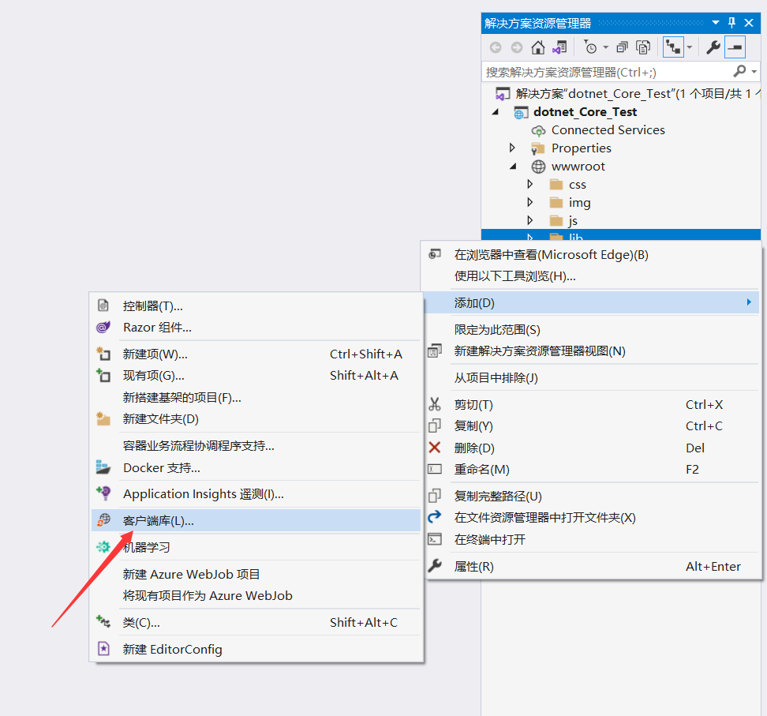
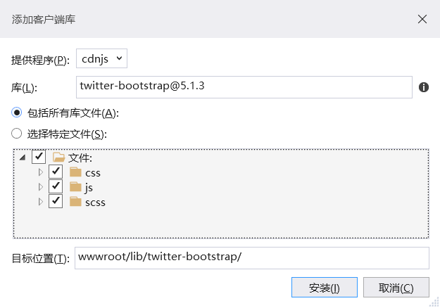

## RenderSection渲染节点
@RenderSection会在母版中占位，由使用此母版页的子页自己去呈现他们的节点（代码代码片段）。

母版页_layout.cshtml中的代码：
```
@RenderSection("script", required: false)
```

子页中的代码：
```
@section script{
    <script src="~/js/test.js"></script><!--节点中的内容在编译时将会被放到母版页_layout.cshtml中-->
}
```
## libman客户端插件包（前端框架包管理）
库管理器(LibMan) 是一个轻量型客户端库获取工具。 LibMan可从文件系统或从内容分发网络(CDN)下载库和框架。 支持的CDN包括 CDNJS、jsDelivr和unpkg。 将提取所选库文件，并将其置于ASP.NET Core项目中的相应位置。

添加过程如下：





点击安装后会自动在指定位置下载库和框架，并在项目目录中新增"libman.json"包管理文件。通过libman.json文件可以对已安装的包进行版本更新或是清空/还原客户端库。

## Tag Helpers 标记帮助程序组件
Tag Helpers 是Asp.Net Core提供的一个强大的功能，它可以在视图中更改和增强现有HTML元素的功能。

在net 5.0中想要使用Tag Helpers需要先进行注册。在视图（Razor页面）或公共引用空间文件（Razor视图导入）中添加`@addTagHelper *,Microsoft.AspNetCore.Mvc.TagHelpers`即可。

下面简单列举Tag Helpers的使用，具体可查看[微软文档](https://docs.microsoft.com/zh-cn/aspnet/core/mvc/views/tag-helpers/built-in/anchor-tag-helper?view=aspnetcore-6.0)。
* `<a asp-controller="home" asp-action="index">返回</a>`
  
   使`<a>`标签不再用传统的`href`属性以硬编码的方式链接目标而是用路由的方式链接目标。

* ``
  
  为图片（静态文件）提供唯一版本号，来解决缓存问题。即在客户端缓存文件以减少用户对服务器的访问。

此外Tag Helpers还支持用户自定义使用。