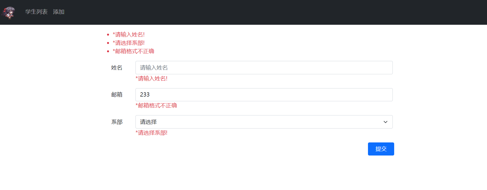

## Asp.Net Core 中的模型绑定
在Asp.Net Core 中可以使用Tag Helper的asp-for属性进行模型绑定。使用前需要先声明绑定的模型对象。Student模型会在下文演示。
```
@model Student
<form asp-controller="home" asp-action="create" method="post">
    <input asp-for="StuName" placeholder="请输入姓名" />
    <input asp-for="Email" placeholder="请输入邮箱" />
    <button type="submit">提交</button>
</form>
```
上述代码中为两个`<input>`标签设置了asp-for属性 .Net Core在程序运行时会自动根据asp-for属性为`<input>`标签设置`id`和`name`属性，使其的数据被表单提交。

此外模型绑定会按以下顺序来查找，将Http的请求数据绑定到控制器的操作方法中对于的参数上。
1. Form Value（表单中的值 post提交）
2. Route Value（路由中的值）
3. Query Value（查询字符串 get提交）
## Asp.Net Core 中的模型验证
在用户发出Http请求提交表单数据储到数据库之前，应用必须先对数据进行验证。 必须检查数据是否存在潜在的安全威胁，确保数据已设置适当的类型和大小格式，并且必须符合相关规则。 

再添加了`using System.ComponentModel.DataAnnotations;`的引用后就可以在模型中属性的上方以 `[characteristic]` 内置特性的方式为模型的属性添加验证。以下代码为Student模型添加的验证。具体的内置特性可以参考[微软文档](https://docs.microsoft.com/zh-cn/aspnet/core/mvc/models/validation?view=aspnetcore-6.0#built-in-attributes)。
```
public class Student
{
    public int ID { get; set; }

    [Display(Name ="姓名"),MaxLength(30,ErrorMessage ="长度不能超过30个字符")]
    [Required(ErrorMessage = "*请输入姓名!")] 
    public string StuName { get; set; }

    [Display(Name = "系部")]//Display仅为显示设置不是验证哦
    [Required(ErrorMessage = "*请选择系部!")]
        public DepartNum? DepartName { get; set; }

    [Display(Name = "邮箱")]
    [Required(ErrorMessage = "*请输入邮箱!"),RegularExpression(@"^[a-zA-Z0-9_-]+@[a-zA-Z0-9_-]+(\.[a-zA-Z0-9_-]+)+$",ErrorMessage ="*邮箱格式不正确")]
    public string Email { get; set; }
}
```
再设置好了模型的验证信息后，需要在表单提交到的方法中用`ModelState.IsValid`启用验证。以下代码中当提交的student模型对象通过验证后，将student存储并返回到index页面。如果验证不通过则输出错误信息。
```
[HttpPost]
public IActionResult create(Student student)
{
    if (ModelState.IsValid)
    {
        this._studentRepository.addStudent(student);
        return new RedirectToActionResult("index", "home", null);
    }
    return View();
}
```
当验证不通过时需要将错误信息返回到客户端页面上，在Asp.Net Core中可以使用Tag Helper提供的`asp-validation-for`或`asp-validation-summary`属性将错误信息输出。可参考以下HTML代码。
```
@model Student
@{
    ViewBag.Title = "学生信息添加";
}
<form asp-controller="home" asp-action="create" method="post" class="mt-3 col-sm-8 m-auto">
    <div asp-validation-summary="All" class="text-danger"></div><!--打印出全部验证信息-->

    <div class="m-3 row">
        <label asp-for="StuName" class="col-sm-1 col-form-label"></label>
        <div class="col-sm-11">
            <input class="form-control" asp-for="StuName" placeholder="请输入姓名" />
            <span asp-validation-for="StuName" class="text-danger"></span>
        </div>
    </div>

    <div class="m-3 row">
        <label asp-for="Email" class="col-sm-1 col-form-label"></label>
        <div class="col-sm-11">
            <input class="form-control" asp-for="Email" placeholder="请输入邮箱" />
            <span asp-validation-for="Email" class="text-danger"></span>
        </div>
    </div>

    <div class="m-3 row">
        <label asp-for="DepartName" class="col-sm-1 col-form-label"></label>
        <div class="col-sm-11">
            <select asp-for="DepartName" asp-items="Html.GetEnumSelectList<DepartNum>()" class="form-select">
                <option value="">请选择</option>
            </select>
            <span asp-validation-for="DepartName" class="text-danger"></span>
        </div>
    </div>

    <button class="btn btn-primary mx-4" type="submit" style="float:right;">提交</button>

</form>
```
具体效果如下图：

