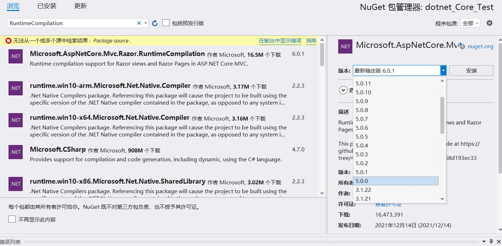

## VS2019中对Razor页面的动态编译
  Asp.Net Core 中的Razor视图本质上其实是一个类，因此在生成启动本地调试后对视图的修改是不能实时反映到浏览器上的。每次微小的改动后都要重新生成编译，启动。带来了很大的不便😥。

  对此只需要引入一个NuGet包就可以实现Razor视图的动态编译（该NuGet包需要.net core 3.0 版本以上框架）。

  NuGet包引入`Microsoft.AspNetCore.Mvc.Razor.RuntimeCompilation`然后在`ConfigureServices`中使用`services.AddControllersWithViews().AddRazorRuntimeCompilation();`注册服务。

  

  ```
public void ConfigureServices(IServiceCollection services)
{
    services.AddControllersWithViews().AddRazorRuntimeCompilation() ;
    services.AddSingleton<IStudentRepository, MockStudentRepository>();
}
  ```

## 依赖注入
依赖注入是一种设计模式，以提高程序模块内聚降低模块间的耦合减少重复的工作提高代码的可维护性为目标。

假设有有两个类A、B，其中类A的功能（方法）的实现需要使用到列类B，那么就称类A依赖于类B。如果采用在类A中实例化类B以实现功能的话那么就会使类A和类B的耦合度较高，当类B需要进行修改时类A也需要进行改造，这样的依赖一旦出现过多就会使程序难以维护，大大增加程序员的工作量。为了避免出现这样的情况就需要将类A对类B的依赖提取出来交给第三方（IOC容器）来控制。有IOC通过构造函数、属性或者工厂模式等方法把类A的依赖注入到类A中。以上就是依赖注入思想。
## Asp.Net Core MVC 中的依赖注入
在`ConfigureServices`中通过`AddSingleton()`、`AddScoped()`、`AddTransient()`进行IOC容器的注册。再由控制器中构造方法注入。
```
public void ConfigureServices(IServiceCollection services)
    {
        services.AddControllersWithViews().AddRazorRuntimeCompilation();//路由启用+razor动态编译
        services.AddSingleton<IStudentRepository, MockStudentRepository>();
        //IOC容器注册，接口IStudentRepository的依赖由MockStudentRepository实现
    }
```
控制器代码：
```
public class HomeController : Controller
{
    private readonly IStudentRepository _studentRepository;
    public HomeController(IStudentRepository studentRepository)
    {
        this._studentRepository = studentRepository;
    }
}
```

## AddSingleton()、AddScoped()、AddTransient()的区别
这三个方法都可以用`ConfigureServices`中对IOC容器的注册，它们的区别在于影响范围不同。
* AddSingleton() 只创建一次实现依赖的实例对象，该实例对象会一直存在于程序的生命周期中，直到程序结束前都不会消失。
* AddScoped() 只有用户每一次不同的HTTP请求都会创建一次实现依赖的实例对象，只有相同的请求才不会创建。
* AddTransient() 用户每一次的HTTP请求都会创建一次实现依赖的实例对象（相同的请求也会）。