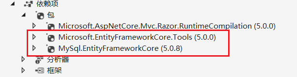

# Entity Framework Core
## 概念解释
对象关系映射（ORM-Object Relational Mapping），是一种程序设计技术，用于实现面向对象编程语言里不同类型系统的数据之间的转换。简单来说就是将开发过程中的Model（对象）与关系型数据库中的二维表所对应。程序员只需要关心业务逻辑成面的设计对数据库的设计与操作全部交给ORM工具来实现。

Entity Framework（ADO.NET Entity Framework）是微软以ADO.NET为基础所发展出来的对象关系对应ORM解决方案。该框架曾经为.NET Framework的一部分，但version 6之后从.NET Framework分离出来。

Entity Framework Core，是Entity Framework 6.0之后微软推出的开源的轻量级可扩展跨平台ORM框架。 EF Core需要和.NET Core应用程序一起使用，并且需要.NET 4.5+版本。

## Asp.Net Core 开发中使用EF Core
在Visual Studio 2019中安装EF Core的核心组件Nuget包和工具Nuget包，不同的数据库对应的EF Core Nuget包不同，具体提供的程序包可查看[微软文档](https://docs.microsoft.com/zh-cn/ef/core/providers/?tabs=dotnet-core-cli)。
如下图安装了EF Core对应MySql数据库的包和Tools包。



新建一个类继承于DbContext类，在其构造方法中接收数据库链接字符串并传递给父类的构造方法。将要映射的Model对象通过`Dbset<>`添加到该该类中。
```
public class mySQLDbContext : DbContext
{
    public mySQLDbContext(DbContextOptions<mySQLDbContext> options):base(options)
    {

    }
    public DbSet<Student> students { get; set; }
}
```
在`appsettings.json`文件中添加数据库连接字符串。一下代码为MySql数据库的连接字符串。
```
  "ConnectionStrings": {
    "conn": "server=localhost;database=StudentDB;uid=root;pwd=123456;port=3306;"
  }
```
在`ConfigureServices`中启用服务并将连接字符串注入。
```
readonly IConfiguration _configuration;
public Startup(IConfiguration configuration) 
{
    _configuration = configuration;
}

public void ConfigureServices(IServiceCollection services)
{
    services.AddControllersWithViews().AddRazorRuntimeCompilation();   //启用MVC路由并实现razor页面动态编译
    services.AddDbContextPool<mySQLDbContext>(options => 
    {
        options.UseMySQL(this._configuration.GetConnectionString("conn"));
    });
}
```
以上信息配置好后就可以在“工具”->"NuGet包管理器"->"程序包管理器控制台"中开始数据迁移了。以下两个命令的功能是添加迁移并将迁移内容更新到数据库中。使用这两个命令我们就可以将代码中Model对象映射到数据中。<br>
* `Add-Migration initName` <br>
新建迁移。第一次使用该命令时会自动在项目中添加名为Migrations的文件夹，每一次新建迁移的时候都会该文件夹下自动生成对应的带时间戳的迁移文件。

* `Update-Database [initName]`<br>
  将迁移更新到数据库中，不指定迁移名时会自动选择最新创建的迁移。该方法除了将代码中的对象映射到数据库中还会在数据库中自动生成一张表（__efmigrationshistory）用于记录迁移历史。

更多的控制台命令可以输入`get-help about_EntityFrameworkCore`来查看。