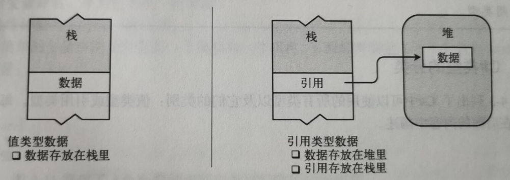

## C#中的类型
C#中提供了16种预定义类型和6种用户自定义类型，这26中类型又可以分为值类型和引用类型，具体如下表。
|            | 值类型                                                                                                                                                                                                                                                                                                                    | 引用类型                                                                                                                  |
| ---------- | ------------------------------------------------------------------------------------------------------------------------------------------------------------------------------------------------------------------------------------------------------------------------------------------------------------------------- | ------------------------------------------------------------------------------------------------------------------------- |
| 预定义     | sbyte（8位有符号位整数） byte（8位无符号位整数） float（单精度浮点数）<br>short（16位有符号位整数） ushort（16位无符号位整数） double（双精度浮点数）<br>int（32位有符号位整数） uint（32位无符号位整数） char（Unicode字符）<br>long（64位有符号位整数） ulong（64位无符号位整数） decimal（小数类型）<br>bool（布尔型） | object（所有其他类的基类）<br> string （零个或多个Unicode字符组成的序列）<br> dynamic（在使用动态语言编写的程序集时使用） |
| 用户自定义 | struct（结构类型） <br> enum（枚举类型）                                                                                                                                                                                                                                                                                  | calss（类类型） <br> interface（接口类型） <br> delegate（委托类型） <br> array（数组类型）                               |

## 栈和堆
程序运行时，其数据必须存储在内存中。运行中的程序使用两个区域来存储数据：栈和堆。
* 栈是一个内存数组，是一个LIFO（先进先出）的数据结构。系统管理所有的栈操作。程序员不需要显式的对它进行任何操作。
* 堆是一块内存区域，在堆里可以分配大块的内存用于存储某种类型的数据对象。与栈不同，堆里内存可以任意存入和移除。虽然堆里可以保存数据，但是并不能显式地删除它们。因此就有了CLR（公共语言运行库）的GC（垃圾收集）功能。CLR的自动垃圾收集器在判断出程序的代码不会再访问的数据项时，会自动清除无主的对对象。

数据项的类型定义了存储数据需要的内存大小以及组成该类型的数据成员。类型还决定了对象在内存的存储位置——栈或堆。
* 值类型只需要一段单独的内存用于存储实际的数据。它存放栈中。
* 引用类型要两段内存。
  * 第一段存储实际的数据，它总是位于堆中。
  * 第二段是一个引用，它存放栈中。指向数据在堆中的位置。
  


## 值类型参数和引用类型参数
* 值类型做为方法的参数时，方法体中的对形参的修改不会影响到实参。引用类型做为方法的参数时，方法体中的对形参的修改会影响到实参。
* C#中的string较为特殊，String是引用类型,但是编译器对其做了特殊处理。
  ```
  string str1 = "王城城";
  string str2 = str1;
  Console.WriteLine($"{str1}\t{str2}";            
  str1 = "王橙橙";
  Console.WriteLine($"{str1}\t{str2}");
  ```
  上述代码输出如下

  >王城城  王城城<br>王橙橙  王城城

  改变str1的值对str2没有影响，这与引用类型的概念违背，当初始化str1时，在堆上分配了一个新的string对象。在初始化s2时引用指向str1，所以str2的值和str1的值一样是"王城城"，但是当改变str1的值时，并不会改变原来的值，为在堆上为str1分配一个新的string对象，str2扔指向原来的对象，所以它的值没有变。这实际上是运算符重载的结果。
* 在值类型的参数前加关键字`ref`可以使其做为引用类型参数使用。
## 输出参数
输出参数用于从方法体内把数据传出到调用代码，它的行为与引用参数类似。用out做为修饰符并且实参必须是变量不能是表达式。
```
 class Program
    {
        static void Main(string[] args)
        {
            fun(5,out int value1,out string value2);
            Console.WriteLine($"{value2} have {value1:c} RMB");
        }

        static void fun(int value,out int outValue1,out string outValue2)
        {
            outValue1 = 233 * value;
            outValue2 = "王城城";
        }
    }
```
上述代码输出如下
>王城城 have ￥1,165.00 RMB

输出参数的存在可以使一个方法有多个输入和输出。

## ref局部变量和ref返回
ref局部变量它允许一个变量是另一个变量的别名。即使引用的对象是值类型，对任意一个变量的赋值操作都会反映到另一个变量上。
```
    class Program
    {
        static void Main(string[] args)
        {  
            person 周树人 = new person() { name = "周樟寿", age = 25, occupation = "doctor" };
            ref person 鲁迅 = ref 周树人;
            鲁迅.age = 40; 
            鲁迅.occupation = "writer";
            周树人.toString();
            鲁迅.toString();
        }
    }
     class person 
    {
        public string name { get; set; }
        public int age { get; set; }
        public string occupation { get; set; }

        public void toString()
        {
            Console.WriteLine($"name:{this.name} age:{this.age} occupation:{this.occupation}");
        }
    }
```
上述代码输出如下
>name:周樟寿 age:40 occupation:writer<br>name:周樟寿 age:40 occupation:writer

别名功能不是ref局部变量最常见的用途。它经常和ref返回功能一起使用。ref返回功能提供了一种使方法返回变量引用而不是变量值的方法。可参考如下代码：比较两个数返回较大的一个数并对其加5
```
int v1 = 10, v2 = 20;
ref int max(ref int value1, ref int value2)
{
    if (value1 > value2)
        return ref value1;
    else
        return ref value2;
}
max(ref v1, ref v2)+=5;
Console.WriteLine(v1+"\t"+v2);
```
上述代码输出如下
>10 &emsp;&emsp;25

需要注意的是返回引用的方法不能将值类型做为返回值，使用上述代码中不能用三元运算`return value1 > value2 ? ref value1 : ref value2;`来简写因为三元运算结果是值类型的。

## 可选参数（参数默认值）
可选参数就是可以在调用方法的时候包含这个参数，也可以省略它。引用类型只有默认值NULL的时候，引用类型才可以用作可选参数。
```
 class Program
    {
        static void Main(string[] args)
        { 
             void fun(string name,string sex="男") 
            {
                Console.WriteLine($"name:{name} sex:{sex}");
            }
            fun("王城城");
            fun("王橙橙","女");
        }
    }
```
上述代码输出如下
>name:王城城 sex:男<br>name:王橙橙 sex:女

## 递归
方法调用自身。递归比起循环适合用于本身适应递归的问题如数学运算。
比如下面输出阶乘的方法。
```
int factorial(int value)
{
     return value <= 1 ? value : value * factorial(value - 1);
}
```